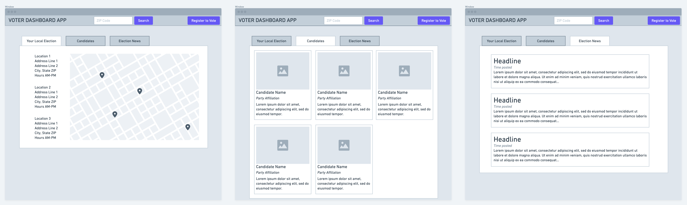

# VOTER DASHBOARD PROJECT (Cool name pending)
## William Tutein, Ruth Schumaker, Judy Naegeli, Medina Khedir, and Chris Parker

### Project Description
Hawaii has the lowest voter registration percentage in the United States. The hope of this application is to provide Hawaiian voters with the following public information.
- Polling stations
    - Dates
    - Hours
    - Location
- Voter registration
    - How register per user's island/county
- Candidate info for chosen location
    - County
    - Major donors
    - Contact information
    - Party/platform
    - Campaign websites
- Local Election News


### User Story
```
As a eligible (potentially unregistered) voter in Hawaii
I want to be able to find polling and candidate information in local elections
So that I can vote in an informed and confident manner.
```

### Wireframe



### APIs

- Information on candidates and how their campaigns are funded.
    [Federal Election Commission](https://api.data.gov/docs/fec/)

- Information on candidates at various levels of government based on location. Also includes polling locations, times, local elections, etc.
    [Google Civic Information](https://developers.google.com/civic-information)

- Associated Press API. Will pull articles to populate app's News Feed with election news.
    [Associated Press](https://developer.ap.org/)

- GIFs returned for related searches (this is a potential API we're looking to incorporate into our app. High chance this is out of scope)
    [Giphy](https://developers.giphy.com/docs/api)


### Tasks
- API/Back End Team
    William, Medina & Ruth
- Front End
    Judy & Chris
- Project Management
    Chris
- Build with new framework
    Judy and Chris
- Content/Copywriting
    Judy
- Testing
    Front end tests Back end, vice versa